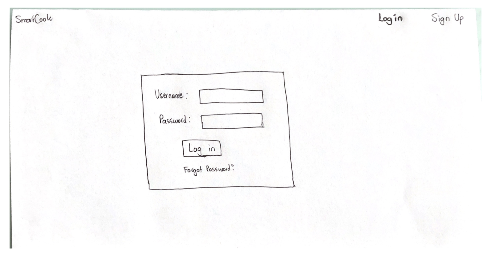
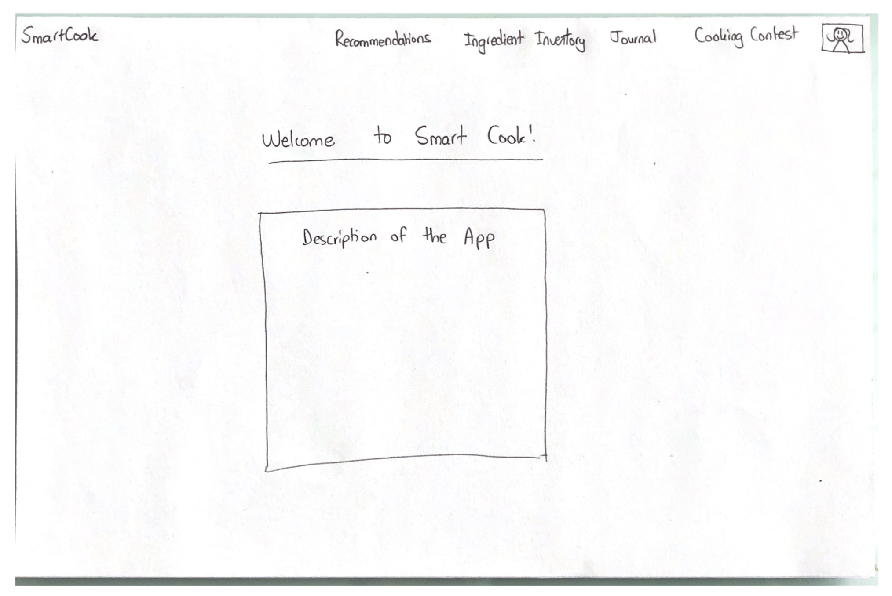
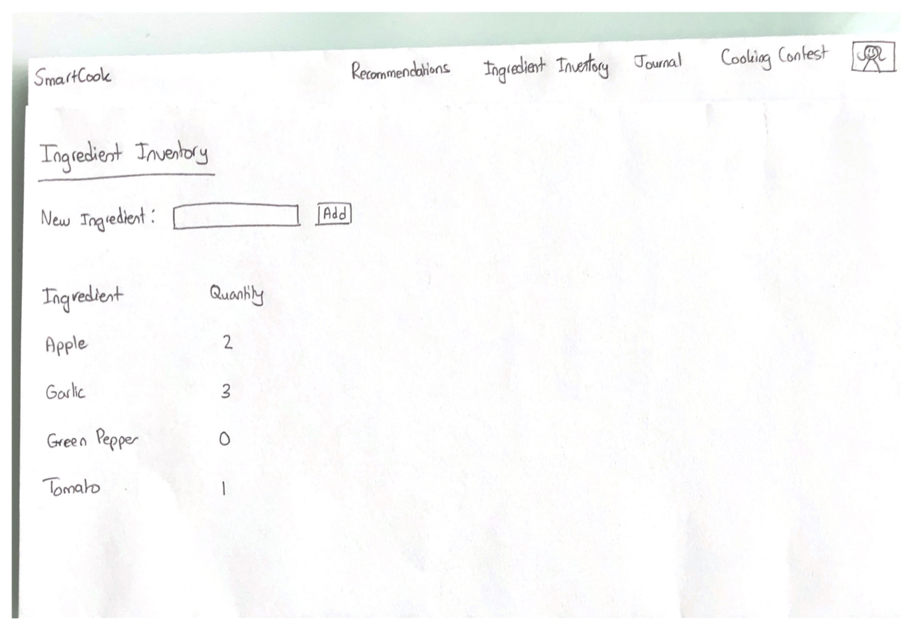

# SmartCook

### Project Description: 
Love to cook but always struggle to come up with ideas? SmartCook is a web app designed for all food lovers who enjoy cooking, exploring new recipes, creating recipe journals, and socializing about food/cooking. It is not just a standard recipe recommendation app. It is an app that keeps track of your ingredient inventory (almost like an online fridge) and recommends you different recipes based on the type of food you like and the ingredients you have on hand. Also, SmartCook allows you to save and customize your favourite recipes into your personal recipe journal. You can upload food pictures and create group chats to communicate on meal planning and vote for your favourite food pictures. The data that will be stored in SmartCook includes recipes, user’s ingredient inventory, user's recipe journal, user account information, chat history, and food pictures uploaded by users. If time allows, we would like to add an online grocery shopping feature that allows users to order groceries online (e.g. Instacart). Both the online grocery shopping and the group chat feature may be added/removed based on time constraint. 

### Project task requirements:
#### 3-5 minimal requirements (will definitely complete)
* Create user interface design 
* Set up database to store data 
* Set up RESTful API to retrieve/store information from different APIs and database
* Create ingredient inventory tracker 
* Implement recipe recommendation system

#### 3-7 minimal requirements (will most likely complete)
* Design recipe journal feature to save user’s favourite recipes/ user’s recipe annotations 
* Create food picture upload feature 
* Build food picture voting feature 

 
#### 2-3 stretch requirements (plan to complete 1!)
* Create group chat feature 
* Create online grocery shopping feature
* Implement a more personalize recommendation system to recommend recipes based on user's most used ingredients/dietary restrictions 

### Task Breakdown
#### Minimal requirement 1: Design user interface
* Design login in & landing page 
* Design different components of the web app: 
  - Recipe recommendation page 
  - Ingredient inventory page
  - Recipe journal page 
  - Food image upload & contest page
* Implement and test webpage navigation/ routing logic 

#### Minimal requirement 2: Set up RESTful API to retrieve/store information from different APIs and database
* Set up Google login authentication 
* Search and test different recipe APIs to decide which APIs to use
* Set up backend end-points & link to APIs to get data 
* Connect frontend and backend
* Test end-points and connection between frontend and backend

### Prototype sketches

